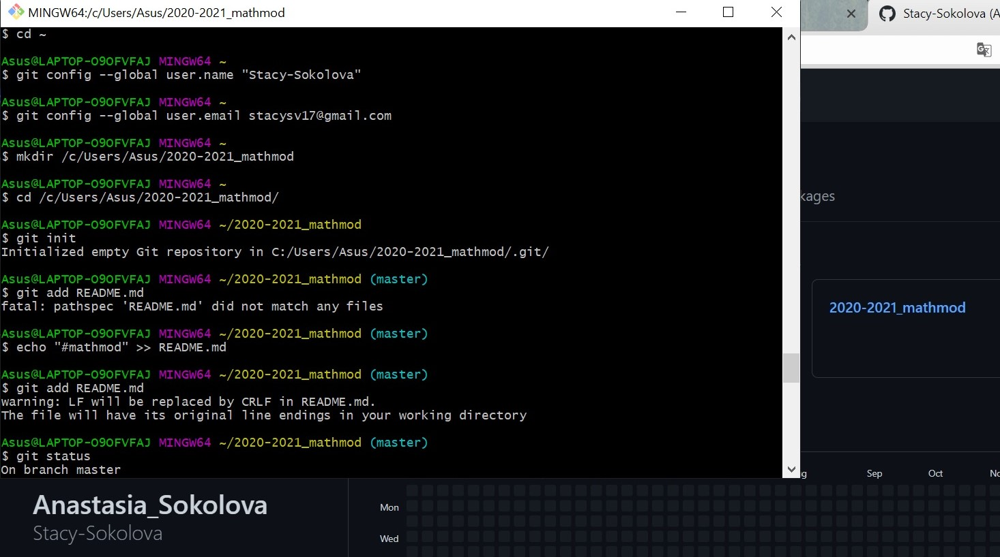
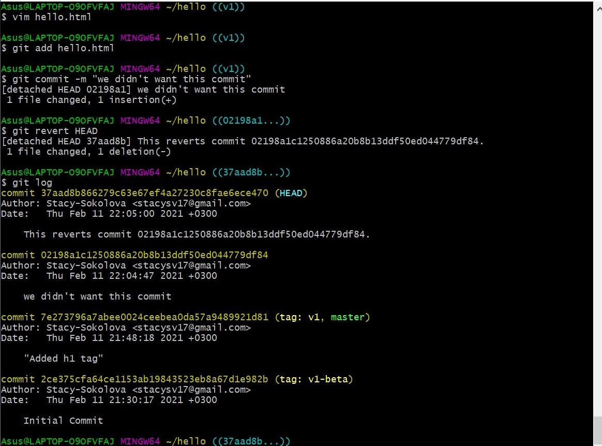

Цель работы
===========

Цель данной лабораторной работы --- освоение работы с системой контроля версий
git, с помощью которой можно удобно и эффективно отслеживать и фиксировать
изменения в файлах или проектах.

Задание
=======

-   Создание аккаунта на Github.

-   Установка ssh-ключа.

-   Создание репозитория

-   Работа с версиями файлов

Выполнение лабораторной работы
==============================

1.Создан аккаунт на Github и репозиторий для будущих работ (рис. [-@fig:001])

2.Установлен git, введено имя и почта (рис. [-@fig:002])

3.Установлен ssh-ключ при помощи команд (рис. [-@fig:003]) 1.ssh-keygen -t rsa
-b 4096 -C "stacysv17\@gmail.com" *генерация ssh-ключа* 2.ssh-add \~/.ssh/id_rsa
*добавление ssh-ключа в ssh-агент* 3.clip \< \~/.ssh.id_rsa.pub *копирование
ключа в буфер обмена для добавления его в аккаунт Github*

4.Создан репозиторий с файлом (рис. [-@fig:004]) 1.mkdir hello + echo "Hello,
World!" \> hello.html *создание файла с именем hello.html* 2.git init + git add
hello.html *создание репозитория из этого каталога и добавление файла в него*
3.git commit -m "Initial Commit" *создание коммита с названием*

5.Произведено фиксирование изменений в файле hello.html (рис. [-@fig:005] и
[-@fig:006]) 1.get status *проверка состояния рабочего каталога после изменений,
выдается подсказка о том, что изменения не были зафиксированы* 2.git add
hello.html *изменение файла проиндексировано и изменение еще не записано* 3.git
commit *дабавлен комментарий "added h1 tag", теперь изменение зафиксировано*

6.Получен список всех произведенных изменений, используя команду git log (рис.
[-@fig:007])

7.Созданы теги версий (рис. [-@fig:008]) 1.git tag v1 *создание тега для текущей
версии* 2.git checkout v1\^ *переход к предыдущей версии* 3.git tag v1-beta
*создание тега для предыдущей версии*

8.Произведена отмена ненужных коммитов (рис. [-@fig:009]) 1.git add hello.html +
git commit -m "we didn't want this commit" *изменение файла и создание коммита*
2.git revert HEAD *отмена нежелательного коммита, редактирование
коммит-сообщения в редакторе*

9.Внесены изменения в коммит (рис. [-@fig:010]) 1.git commit --amend -m "added
personal name and email" *когда в файл добавили новые изменения к предыдущим и
нет смысла создавать новый коммит, мы его изменяем*

Выводы
======

Осуществлена работа с репозиторием, применены основные функции к ней, в
частности, связанные с управлением версиями файлов, отслеживания изменений и
переключения между ними.
